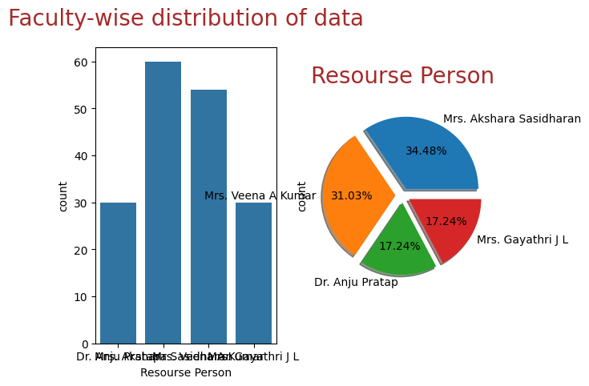
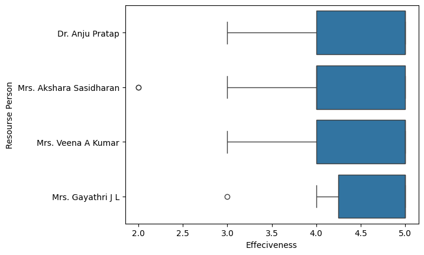
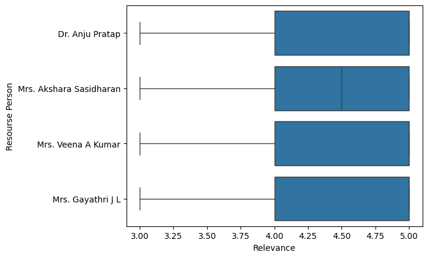
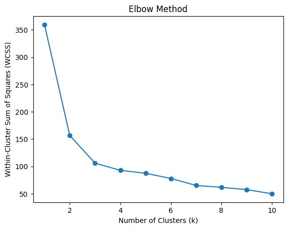
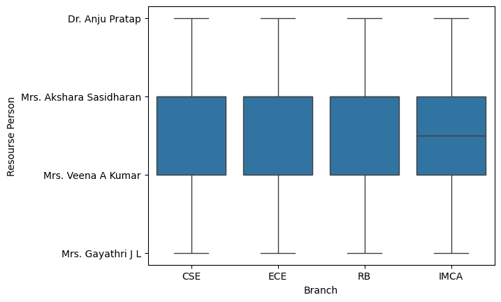
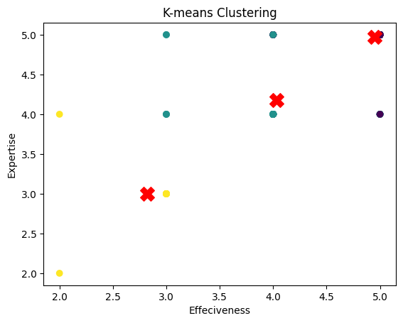

# Feedback Analysis for Intel course

## Introduction
The analysis will focus on the feedback data collected from participants of a session, aiming to extract insights and identify patterns related to the participants' perceptions and satisfaction levels.

## Dataset overview

The dataset contains feedback responses from participants of a session. It includes several columns:

**Timestamp:** The date and time when the feedback was submitted.

**Name of the Participant:** The name of the participant who provided the feedback.

**Email ID:** The email address of the participant.

**Branch:** The branch of study of the participant.

**Semester:** The current semester of the participant.

**Resource Person of the session:** The resource person for the session.

**Ratings:** There are multiple columns related to ratings provided by the participants, covering the overall quality and relevance of the course content, the effectiveness of training methods and delivery style, the resource person's knowledge and expertise, the relevance and applicability to real-world industry scenarios, and the overall organization of the session.

## Exploratory Data Analysis (EDA)

- **Resource Person-wise Distribution:** The dataset was analyzed to see how feedback is distributed across different resource persons, showing a varied participation rate.

- **Participant Name Analysis:** A value counts normalization showed the number of feedback entries per participant, indicating engagement levels across participants.
- **Visualization:** Several visualizations were created to understand the faculty-wise distribution of data, the distribution of ratings across different categories, and the distribution of feedback by branch of study.

## Faculty-wise Distribution of Data:

- The bar graph and pie chart show the count and percentage distribution of sessions handled by different resource persons.
- Mrs. Akshara Sasidharan and Mrs. Veena A Kumar appear to have the highest number of sessions, with Mrs. Gayathri J L and Dr. Anju Pratap having a smaller share.

     

## Content Quality:

- The boxplot for content quality across different resource persons indicates high median ratings, suggesting overall positive feedback.
-  There are no outliers, and the interquartile range is narrow for all, which means the ratings were consistently high across participants.

    
*Content Quality Ratings by Faculty*

 ## Effectiveness:

- The effectiveness of the sessions seems to be rated highly as well, with few outliers indicating occasional deviations from otherwise high ratings.
- Mrs. Veena A Kumar and Mrs. Gayathri J L have outliers on the lower end, which might suggest specific sessions where the effectiveness was rated lower than usual.

    
*Effectiveness Ratings by Faculty*

## Expertise:

- Similar to effectiveness, expertise ratings are high with few outliers.
- The outliers for Mrs. Veena A Kumar and Mrs. Gayathri J L again suggest that there were certain sessions where the perceived expertise of the resource person was not up to the participants' expectations.

    
*Expertise Ratings by Faculty*

## Relevance:

The relevance of the session content shows no outliers and high median values, indicating that the participants found the sessions to be generally applicable to real-world scenarios.

  
*Relevance Ratings by Faculty*

## Elbow Method for Optimal Clusters:

The Elbow Method graph suggests that the within-cluster sum of squares (WCSS) significantly drops until around 5 clusters, which might be considered the optimal number of clusters for the K-means algorithm in this context.

### Ratings by Branch

The boxplot for branch-wise ratings illustrates the feedback across different academic departments. All branches show tight interquartile ranges in content quality ratings, with a few outliers, suggesting consistent perceptions of content quality regardless of the branch.

  
*Branch-Wise Ratings*

## Machine Learning: K-means Clustering
K-means clustering was applied to segment participants based on their feedback ratings, with the following steps:

- Feature Selection: Feedback ratings on the overall quality and relevance of the course content, effectiveness, expertise, relevance, and overall organization were used as features for clustering.
 
- Finding the Optimal Number of Clusters (k): The Elbow Method was employed to determine the optimal number of clusters, with an analysis suggesting k=5 as a suitable choice.

- Implementing K-means Clustering: The K-means algorithm was applied to segment the data into clusters, aiming to identify patterns in participant satisfaction and perception.

- Cluster Analysis: The clusters were analyzed to understand the characteristics of feedback within each group, providing insights into areas of strength and opportunities for improvement.

  
*Cluster Visualization*

The scatter plot for K-means clustering shows the relationship between 'Effectiveness' and 'Expertise' ratings given by the participants. The plot is likely divided into clusters represented by different colors, with cluster centroids possibly marked by a distinct symbol such as a red 'X'. The distribution of points suggests variability in participant perceptions, with most data points congregating towards higher ratings, indicating general satisfaction. However, some points are scattered towards the lower end of the scales, representing varied opinions or less positive experiences that could be areas for improvement. This clustering visualization aids in identifying patterns and segments within the participant feedback which can be critical for tailored improvements in future sessions.

## Conclusion

- Segmentation of Feedback: The clustering revealed distinct segments of participants based on their satisfaction levels and perceptions. This can help in tailoring follow-up actions and improvements to meet the specific needs of each group.
- Areas for Improvement: Analysis of the ratings across different dimensions can highlight areas where the session could be improved, such as the effectiveness of delivery methods or the relevance of content to real-world scenarios.
- Resource Person Performance: Feedback on resource persons can be used to identify areas of strength and opportunities for professional development.
